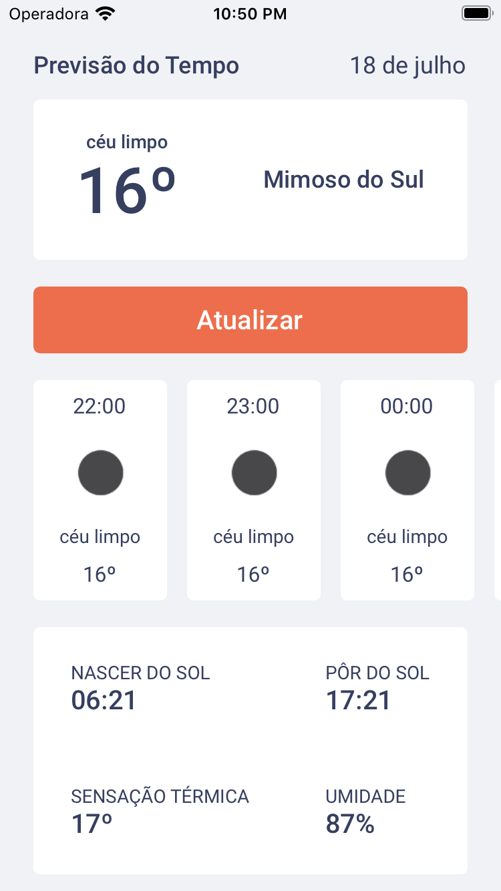

<h1 align="center">
    
</h1>
 <p align="center">Aplicativo para previsão do tempo.</p>
<p align="center">
  <a href="https://github.com/daviseares/status-code/commits/master">
    
  </a>

  
</p>

<br>


## 📱 Telas do projeto

<p align="center">
  
   
</p>

## 🚀 Tecnologias

Entre as tecnologias utilizadas, destaca-se:

- [Styled Components](https://www.typescriptlang.org/)
- [TypeScript](https://www.typescriptlang.org/)
- [React Native v0.63](https://facebook.github.io/react-native/)
- [React Navigation](https://reactnavigation.org/)
- [Yarn](https://expo.io/)
- [Moment](https://momentjs.com/)
- [Axios](https://github.com/axios/axios)
- [OpenWeatherMap API](https://openweathermap.org/)


### 💻 Installation

```bash
# Clone this repository
$ git clone https://github.com/daviseares/goweather.git

# Go into the repository
$ cd goweather

# Install dependencies
$ yarn

# IOS
$ cd ios/
$ pod install
$ cd ..
$ yarn ios

# Android
$ yarn android

```


## 🤔 Como contribuir

- Faça um fork desse repositório;
- Cria uma branch com a sua feature: `git checkout -b minha-feature`;
- Faça commit das suas alterações: `git commit -m 'feat: Minha nova feature'`;
- Faça push para a sua branch: `git push origin minha-feature`.

Depois que o merge da sua pull request for feito, você pode deletar a sua branch.

## :memo: Licença

Esse projeto está sob a licença MIT. Veja o arquivo [LICENSE](LICENSE.md) para mais detalhes.

---

Feito com ♥ &nbsp;by Davi Borges.

